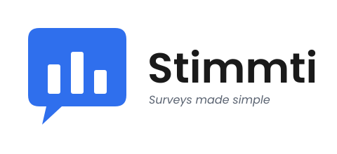
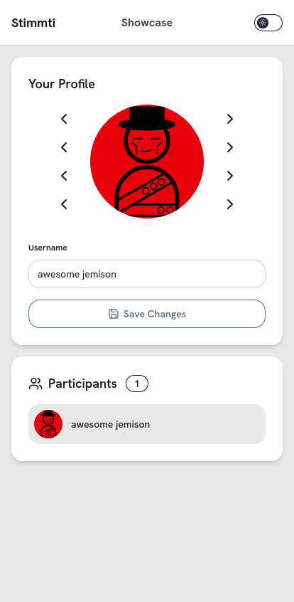
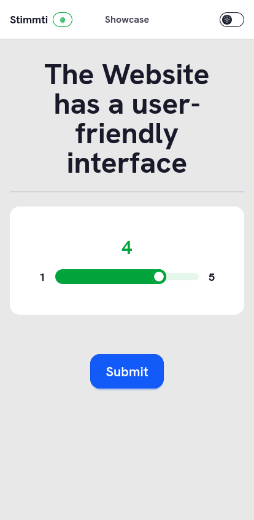
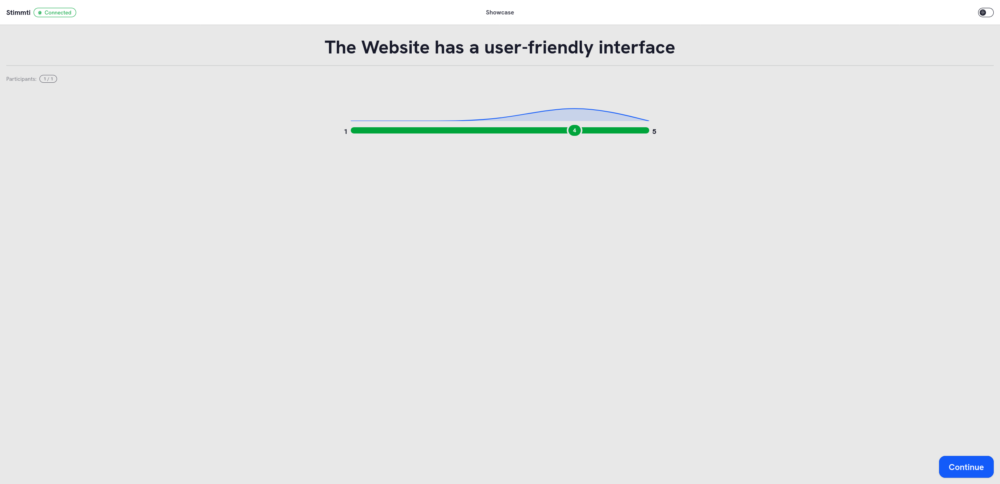
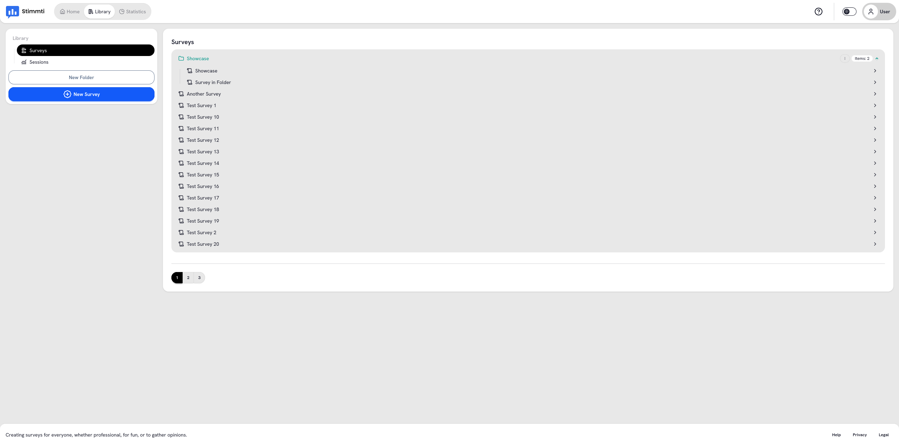
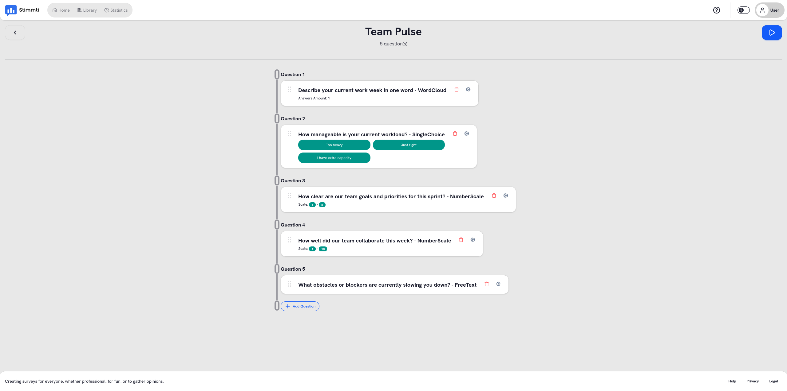
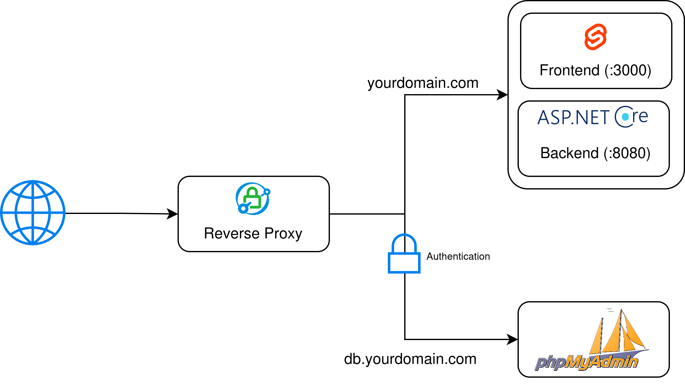

<div align="center">

<p align="center" style="background-color: white;">
  <picture>
    <source media="(prefers-color-scheme: dark)" srcset="Frontend/static/stimmti-logo-light.svg">
    <source media="(prefers-color-scheme: light)" srcset="Frontend/static/stimmti-logo.svg">
    
  </picture>
</p>

**Interactive live polling and instant audience feedback for presentations, lectures, and workshops.**

[](LICENSE)
[](https://dotnet.microsoft.com/)
[](https://svelte.dev/)
[](https://tailwindcss.com/)
[](https://www.docker.com/)
[](#key-features)

[Features](#key-features) • [Visual Showcase](#visual-showcase) • [Tech Stack](#tech-stack) • [Quick Start](#quick-start-development) • [Deployment](#production-deployment) • [Configuration](#configuration--environment-variables)

</div>

---

## Overview

**Stimmti** is an open-source, self-hostable audience engagement platform built for real-time interaction during talks, classroom lectures, and interactive workshops. It enables presenters to capture instant feedback, run live polls, and visualize audience sentiment with zero latency.

### Why Stimmti?
- **Zero Friction for Attendees:** No app download, no registration, no personal data required. Participants join in seconds by scanning a QR code or entering a room code.
- **Engaging & Anonymous:** Attendees customize modular avatars (hats, faces, body styles, and color palettes) while remaining completely anonymous.
- **Responsive:** Real-time bi-directional synchronization powered by ASP.NET Core SignalR and WebSockets.
- **Privacy & Self-Hosting First:** Full control over your data. Pre-configured with Docker Compose, automated TLS via Caddy, and GDPR / German DDG compliance fields.

---

## Key Features

- **Real-Time Live Sessions:** Instant vote aggregation and dynamic chart updates without page reloads using SignalR.
- **Modular Avatar Builder:** Attendees create randomized or customized avatars with diverse hats, face expressions, body shapes, and color profiles.
- **5 Question Types:**
  - **Single Choice:** Traditional single-select multiple-choice poll with live percentage distribution.
  - **Multiple Choice:** Multi-selection poll for gathering preferences or priorities.
  - **Word Cloud:** Dynamic audience word clusters grouped and weighted in real time.
  - **Number Scale:** Numeric Likert-style scale evaluations with distributional graphs.
  - **Free Text:** Open-ended qualitative feedback collected in an organized stream.
- **Presenter Workspace:**
  - Organize surveys into customizable folders.
  - Reusable template library for quick-start presentations.
  - Session control: open, advance, and close rooms on demand.
- **Statistics & Analytics:** Review historic survey results, participant turnout, and vote breakdowns.
- **Turnkey Docker Stacks:** One-command setup for development, production, and optional Prometheus + Grafana monitoring.

---

## Visual Showcase

### 1. Participant Experience (Mobile First)

<div style="display: flex; gap: 0.5rem; width: 100%; justify-content: center;">
    
    
</div>

---

### 2. Presenter Live Stage & Real-Time Results

<div style="display: flex; width: 100%; justify-content: center;">
    
</div>

---

### 3. Survey Builder & Folder Organization

<div style="display: flex; flex-direction: column; gap: 0.5rem; width: 100%; align-items: center;">
    
    
</div>

---

## Tech Stack

| Layer | Technology | Description |
| :--- | :--- | :--- |
| **Backend API** | [ASP.NET Core 10](https://dotnet.microsoft.com/) | High-performance C# REST Web API |
| **Real-Time** | [SignalR](https://dotnet.microsoft.com/apps/aspnet/signalr) | WebSocket / Live event broadcasting |
| **Database ORM** | [EF Core 10](https://learn.microsoft.com/ef/core/) + MySQL 8.0 | Relational schema management, LINQ queries, and migrations |
| **DTO Mapping** | [Mapperly](https://mapperly.riok.org/) | Compile-time safe C# object mapping |
| **Frontend** | [SvelteKit 2](https://svelte.dev/) / Svelte 5 | Fast, reactive SPA with modern runes |
| **Styling** | [Tailwind CSS](https://tailwindcss.com/) + DaisyUI / Lucide | Responsive, accessible, and customizable themeable UI |
| **API Client** | TypedSignalR + swagger-typescript-api | Fully typed WebSocket and REST client generation |
| **Reverse Proxy** | [Caddy 2](https://caddyserver.com/) | Reverse proxy with automatic HTTPS / Let's Encrypt certificates |
| **Monitoring** | [Prometheus](https://prometheus.io/) & [Grafana](https://grafana.com/) | System metrics and node performance dashboard |
| **Containers** | Docker & Docker Compose | Multi-container reproducible environments |

---

## System Architecture

Stimmti is designed as a decoupled client-server architecture with an edge reverse proxy and dedicated WebSocket channels for low-latency live polling.

<div style="display: flex; width: 100%; justify-content: center;">
    
</div>

---

## Quick Start (Development)

Follow these steps to run a local development environment.

### Prerequisites
- [.NET 10 SDK](https://dotnet.microsoft.com/download/dotnet/10.0)
- [Node.js](https://nodejs.org/) (v20+ recommended) & `npm`
- [Docker & Docker Compose](https://www.docker.com/)

### 1. Start the Development Database
Start local MySQL and phpMyAdmin containers:
```bash
docker compose -f devdb.compose.yaml up -d
```

### 2. Start the Backend API
```bash
cd Backend
dotnet restore
dotnet run
```
*The API will start at `http://localhost:5202`.*

### 3. Start the Frontend
In a new terminal window:
```bash
cd Frontend
npm install
npm run dev
```
*The Svelte development server will start at `http://localhost:5173`.*

### Development Access Points

| Service | Local URL | Default Credentials | Description |
| :--- | :--- | :--- | :--- |
| **Frontend** | [http://localhost:5173](http://localhost:5173) | User: `Admin`, Pass: `Tester42` (only present in dev environment) | Presenter & Participant Web App |
| **Backend Swagger** | [http://localhost:5202/swagger](http://localhost:5202/swagger/index.html) | — | OpenAPI documentation & test client |
| **phpMyAdmin** | [http://localhost:8080](http://localhost:8080) | Server: `db`, User: `root`, Pass: `root` | Database management UI |
| **MySQL Database** | `localhost:3306` | User: `root`, Password: `root` | Raw database connection |

---

## Production Deployment

Stimmti provides a production-ready Docker Compose configuration with automated TLS via Caddy.

### 1. Configuration
Clone the repository and prepare your environment files:
```bash
cp .env.example .env
cp Caddyfile.example Caddyfile
```

Edit `.env` to match your production domain, strong database credentials, and legal imprint:
```ini
DOMAIN=stimmti.yourdomain.com
CORS_ORIGINS=https://stimmti.yourdomain.com
MYSQL_ROOT_PASSWORD=YourSuperSecretRootPassword!
MYSQL_APP_USER=stimmti_app
MYSQL_APP_PASSWORD=YourSuperSecretAppPassword!
PUBLIC_API_URL=https://stimmti.yourdomain.com
```

Edit `Caddyfile` to specify your reverse proxy rules and credentials for phpMyAdmin if enabled.

### 2. Launch Services
Start the full application stack in detached mode:
```bash
docker compose --env-file .env -f prod.compose.yaml up -d
```

### 3. Optional: Enable Monitoring (Prometheus & Grafana)
To start node monitoring alongside your production deployment:
```bash
docker compose -f monitoring.compose.yaml up -d
```
Grafana will be accessible according to your `monitoring.compose.yaml` and Caddy reverse proxy routing.

---

## Configuration & Environment Variables

Key parameters configured in `.env`:

| Variable | Description | Example / Default |
| :--- | :--- | :--- |
| `DOMAIN` | Public domain name of the deployment | `stimmti.example.com` |
| `PUBLIC_API_URL` | Base API endpoint accessible by clients and SignalR | `https://stimmti.example.com` |
| `CORS_ORIGINS` | Comma-separated list of allowed origins for the backend | `https://stimmti.example.com` |
| `MYSQL_ROOT_PASSWORD` | Strong password for MySQL root user | `MegaSecurePass123!` |
| `MYSQL_APP_USER` | Dedicated application user for backend connection | `stimmti_app` |
| `MYSQL_APP_PASSWORD` | Password for the dedicated application user | `AnotherMegaSecurePass!` |
| `GRAFANA_PASSWORD` | Admin password for the Grafana dashboard | `SecureGrafanaPassword!` |
| `PUBLIC_LEGAL_*` | Legal notice & GDPR provider info (Name, Street, Email, etc.) | *Configurable per legal entity* |

---

## Contributing

Contributions, feedback, and bug reports are warmly welcome!
1. Fork the repository
2. Create your feature branch (`git checkout -b feature/description`)
3. Commit your changes (`git commit -m 'feat: add new feature'`)
4. Push to the branch (`git push origin feature/description`)
5. Open a Pull Request

---

## License

This project is licensed under the **GPL 3.0 License** — see the [LICENSE](LICENSE) file for details.
